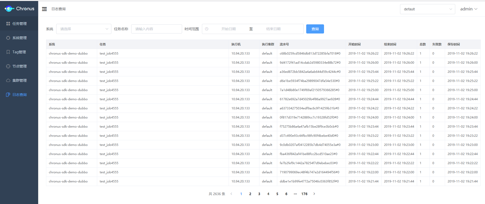

.png)

**Chronus**是360金融技术团队基于阿里开源项目-TBSchedule进行重写的分布式调度平台，内部经历了5个里程碑版本。平台零开发，无缝支持Dubbo协议，未来支持Http，SpringCloud，期望成为微服务生态轻量级分布式调度平台。为了回馈开源社区，保证开源质量、稳定性，持续投入，开源内部生产版本，内外部版本保持一致。得益于继承TBSchedule良好设计思想，Chronus经过大量Job生产验证，稳定性达99.999%。
                                                                       
## Architecture


## Features

* 平台零开发，业务系统引入SDK，实现接口即可。 
* Master-Worker模式，分布式集群调度，水平扩展，任务自动故障转移，解决大量job调度问题。
* 调度组物理隔离，基于TAG实现Job的物理隔离执行，重要业务不受影响。
* 细粒度权限控制，符合内控安全需求。
* 外部依赖插件化，支持多种注册方式、多种存储方式。
* 界面友好，丰富的管理功能。

## Getting started

### Maven dependency

```xml
<dependency>
    <groupId>com.qihoo.finance.chronus</groupId>
    <artifactId>chronus</artifactId>
    <version>1.0.0</version>
</dependency>
```

### Defining spring bean handler

```java
@Service("selectExecuteBean")
public class SelectExecuteBean implements ChronusSdkSingleJob<Integer> {
    private static final Logger logger = LogManager.getLogger(SelectExecuteBean.class);

    @Override
    public List<Integer> selectTasks(String taskParameter, List<TaskItemDefineDomain> list, int eachFetchDataNum) throws Exception {
        List<Integer> result = new ArrayList<>();
        //查询数据集合
        return result;
    }

    @Override
    public boolean execute(Integer domain, String taskParameter) throws Exception {
        // 处理集合中的每一项
        return true;
    }
}

```

## Document

## Screenshot



 

## Downloads

## Contact

* Website: [https://www.360jinrong.net](https://www.360jinrong.net)
* Mail: [dev-service@360jinrong.net](dev-service@360jinrong.net)
* Bugs: [Issues](https://github.com/360jinrong/Chronus/issues/new?template=chronus-issue-report-template.md)

## Who Uses Chronus
请在 [谁在使用Chronus #18](https://github.com/360jinrong/chronus/issues/18) 提供您的信息共同改变Chronus


## License

[Apache 2.0 license.](/LICENSE) Copyright (C) 360 Finance, Inc.
